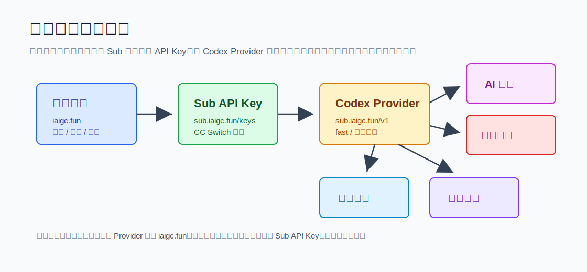
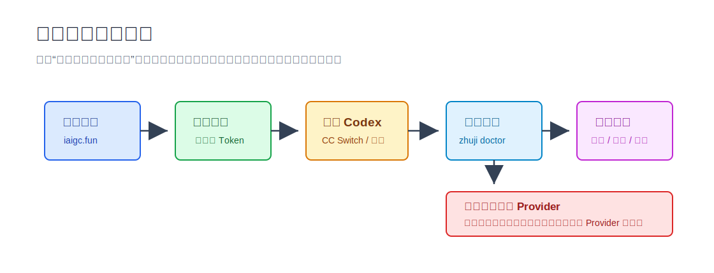

# 筑基插件

**筑基插件**是给筑基用户使用的 Codex 插件包。

[筑基 AI](https://iaigc.fun) 是筑基主站，提供模型套餐、灵石额度、控制台令牌、调用日志、文档、CC Switch / Cherry Studio 导入和 OpenAI 兼容 API。普通用户在主站注册登录、创建令牌，再把 Codex Provider 配到筑基 API，就可以在 Codex 里使用筑基模型、生图能力和常用加速配置。

客户端推荐 API Base：

```text
https://api.iaigc.fun/v1
```

如果当前 Codex Provider 不是筑基，插件会停止筑基专属动作，例如筑基生图、筑基模型请求和额度相关检查，并引导用户去主站注册、创建令牌和重新配置 Provider。



## 快速开始

在 Codex 里直接说：

```text
看看我能用哪些功能
```

插件会先做新手向导：

1. 介绍筑基主站、API Base、令牌和 CC Switch 导入路径。
2. 脱敏检查当前 Codex 是否已经接入筑基。
3. 如果没有接入，先引导注册和配置 Provider。
4. 如果已经接入，再按目标分流到生图、插件、记忆或飞书。



## 功能入口

- `zhuji-guide`：筑基使用向导
- `zhuji-setup`：接入筑基
- `zhuji-codex-plugins`：开启 Codex 插件
- `zhuji-image`：AI 生图
- `zhuji-memory`：长期记忆
- `zhuji-feishu`：移动端配置

| 入口 | 用户说法 | 做什么 | Provider 要求 |
|---|---|---|---|
| 筑基使用向导 | 看看我能用哪些功能 | 介绍站点、检查本机、分流能力 | 不要求 |
| 接入筑基 | 帮我接入筑基 | 配置 Provider、CC Switch、fast、长上下文 | 用来配置筑基 |
| 开启 Codex 插件 | 帮我开启 Codex 插件 | 解锁插件、处理官方登录态、备份回滚 | 不要求，但会保持模型走筑基 |
| AI 生图 | 帮我用 Codex 生图 | 通过筑基 Provider 调 `gpt-image-2` | 必须是筑基 |
| 长期记忆 | 帮我创建长期记忆 | 初始化本地记忆工作区和每日整理 | 不要求 |
| 移动端配置 | 帮我配置飞书入口 | 用飞书给本地 Codex 发任务和收回复 | 不要求 |

## 辅助脚本

- `scripts/zhuji_doctor.mjs`：脱敏检查本机 Codex 登录、配置和常见入口。
- `scripts/ccswitch_codex_config.mjs`：生成 CC Switch / Codex 一键导入推荐配置。
- `scripts/zhuji_image_request.mjs`：按用户显式要求调用筑基图片接口。
- `scripts/install_memory_workspace.mjs`：调用本机 `codex-x` 初始化记忆工作区。
- `scripts/backup_codex_state.sh`：修改 Codex 登录态或配置前的备份和回滚脚本。

## 怎么验证

本地检查：

```bash
npm test
npm run doctor
node scripts/zhuji_doctor.mjs --json
python3 /Users/armysheng/.codex/skills/.system/plugin-creator/scripts/validate_plugin.py /Users/armysheng/plugins/iaigc-fun-plugin/plugins/iaigc-fun-plugin
```

手工 review 重点：

- README 第一屏是否说清楚筑基主站是什么、提供什么服务。
- 非筑基 Provider 时，`zhuji_doctor.mjs` 是否输出 `zhuji_provider_detected=false`，`--json` 是否给出 `status/actions`。
- `zhuji-image` 是否明确拒绝非筑基 Provider。
- 默认提示词是否能把新用户带到“筑基使用向导”。
- 文档里是否避免泛化客群表达，统一说“筑基用户”。

## 安装

给 Codex 安装：

```bash
codex plugin marketplace add iaigc-fun/iaigc-fun-plugins --ref main
codex plugin add iaigc-fun-plugin@iaigc-fun
```

手动拉源码安装：

```bash
git clone https://github.com/iaigc-fun/iaigc-fun-plugins.git ~/plugins/iaigc-fun-plugins
codex plugin marketplace add ~/plugins/iaigc-fun-plugins
codex plugin add iaigc-fun-plugin@iaigc-fun
```

更多说明见 [安装方式](./docs/INSTALL.md)。

## 文档

- [产品说明](./docs/PRODUCT.md)
- [安装方式](./docs/INSTALL.md)
- [GitHub 仓库准备](./docs/GITHUB_SETUP.md)
- [发布检查清单](./docs/RELEASE_CHECKLIST.md)
