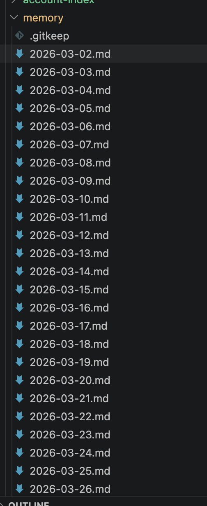
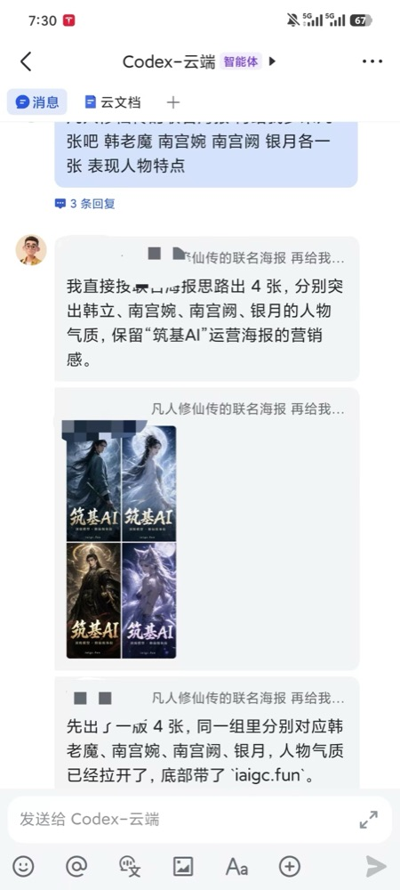

# 筑基插件产品说明

## 产品定位

**筑基插件**是给筑基用户使用的 Codex 插件包。它不是泛泛的通用配置包，而是围绕 [筑基 AI](https://iaigc.fun) 主站、[筑基AI 分站 / Sub 道场](https://sub.iaigc.fun)、筑基 API、Sub 道场 API Key、CC Switch 导入和 Codex 使用体验做的一套中文向导。

筑基 AI 主站和 Sub 道场提供：

- 主站模型套餐、灵石额度、充值订阅和文档入口。
- Sub 道场 OpenAI 兼容 API：`https://sub.iaigc.fun/v1`。
- Sub 道场 API Key：`https://sub.iaigc.fun/keys`。
- 调用日志、额度查看和模型列表。
- CC Switch Codex / Claude Code、Cherry Studio 等客户端导入入口。
- 生图能力和常见模型映射。

插件目标是让用户少碰 TOML、Provider、feature flag、endpoint 这些技术词，直接按“我要接入、我要生图、我要手机用、我要记忆”完成任务。

## 一级入口

| 入口 | 用户看到的名字 | 用户会怎么理解 |
|---|---|---|
| `zhuji-guide` | 筑基使用向导 | 先告诉我筑基是什么、我能用哪些功能、现在有没有接好 |
| `zhuji-setup` | 接入筑基 | 让 Codex 用上筑基模型，并自动配好推荐参数 |
| `zhuji-codex-plugins` | 开启 Codex 插件 | 让本地插件可用；官方 Apps/远程插件需要时再处理登录态 |
| `zhuji-image` | AI 生图 | 在 Codex 里只通过筑基 Provider 使用 `gpt-image-2` 生成图片 |
| `zhuji-memory` | 长期记忆 | 让 Codex 记住用户、项目、绘画需求、最近上下文和重要决定 |
| `zhuji-feishu` | 移动端配置 | 通过飞书在手机上给本地 Codex 发任务和收回复 |

## 为什么这样分

这 6 个入口按用户任务划分，不按技术模块划分。

- **筑基使用向导** 是新手入口，回答“我能用什么、现在缺什么、下一步点哪里”。
- `CC Switch`、`fast mode`、长上下文、自动压缩都属于 **接入筑基**。
- 本地插件安装、插件灰屏、插件功能开关都属于 **开启 Codex 插件**；官方 ChatGPT 登录只在官方 Apps/远程插件确实需要时处理。
- 生图只讲 **Codex 里使用筑基 Provider 的 `gpt-image-2`**，不讲操练场；如果 Provider 不是筑基，直接拒绝真实生图。
- 移动端只讲 **飞书入口**，不默认展开公网远程访问。
- 记忆继承 `codex-x` 的本地文件模型，但用户入口只叫 **长期记忆**；首次初始化时要提示是否做一次历史会话/绘画需求抽取。

## 价值案例

### AI 生图

用户可以把短视频截图、商品参考图或一句中文需求交给 Codex，让插件先确认当前 Provider 是筑基，再通过筑基 Provider 使用 `gpt-image-2` 生成图片。新版默认使用 Sub 道场 API Key 和 `https://sub.iaigc.fun/v1`；真实生图只读取 `ZHUJI_API_KEY`，没有时停止请求并引导用户到 `https://sub.iaigc.fun/keys` 新建 key，不复用 Codex Provider key 或 `OPENAI_API_KEY`。图片消耗按 Sub 道场分组的图片倍率计算，当前图片倍率口径为 `2.0`，最终以 Sub 道场页面实值为准。典型价值是把“我看到一个草鞋灵感”变成可继续修改的商品详情图、主图或海报素材。

<p>
  
  
</p>

### 长期记忆

长期记忆不是一句“记住了”，而是把项目状态、用户偏好、绘画需求、历史会话抽取结果和每日整理落成本地文件。初始化时要提醒 token 成本，尤其是首次抽取历史会话和绘画材料时。



### 移动端配置

移动端入口优先走飞书：用户在手机上就能把临时灵感、图片需求或任务发给本地 Codex，并收到 Codex 的处理结果。这个入口适合“不在电脑前，但想继续指挥 Codex”的场景。



## 新手向导

默认提示词第一项是：

```text
看看我能用哪些功能
```

向导应该按这个顺序回答：

1. 用两三句话介绍筑基 AI 主站、Sub 道场 API Base、API Key、套餐/灵石和调用日志。
2. 从插件根目录运行 `node scripts/zhuji_doctor.mjs` 做脱敏检查；需要机器可读结果时用 `node scripts/zhuji_doctor.mjs --json`。
3. 如果 `zhuji_provider_detected=false`，先停止筑基专属动作，引导用户：
   - 打开 `https://sub.iaigc.fun` 注册/登录。
   - 进入 `https://sub.iaigc.fun/keys` 创建或复制 API Key。
   - 通过 CC Switch Codex 导入，或手动配置 `base_url = "https://sub.iaigc.fun/v1"`。
   - 如果旧 Provider 仍是 `https://api.iaigc.fun/v1` 或 `https://router.iaigc.fun/v1`，提示这是历史入口，建议迁移到 Sub 道场。
4. 如果已接入，按用户目标分流到接入检查、AI 生图、Codex 插件、长期记忆或飞书。

## Provider 拒绝规则

这些动作必须确认当前 Provider 是筑基；真实生图还必须有用户显式传入的 `ZHUJI_API_KEY`：

- 通过 `gpt-image-2` 发起真实生图请求。
- 解释筑基额度、灵石、套餐消耗。
- 声称“当前 Codex 已经走筑基模型”。
- 调用任何筑基 API。

如果不是筑基 Provider，文案要直说：

```text
当前 Codex Provider 不是筑基，我先不继续这个筑基专属动作。
你可以打开 https://sub.iaigc.fun 注册/登录，在 https://sub.iaigc.fun/keys 创建 API Key，然后用 CC Switch Codex 导入；
或把 Codex Provider 的 base_url 配成 https://sub.iaigc.fun/v1，并使用 Sub 道场 API Key。
```

生图 key 决策树：

1. 当前环境有 `ZHUJI_API_KEY`：直接使用它调用图片接口，并提醒会消耗图片额度。
2. 当前环境没有 `ZHUJI_API_KEY`：停止真实请求，引导用户打开 `https://sub.iaigc.fun/keys` 新建 key。
3. 用户新建 key 后：让用户临时传入 `ZHUJI_API_KEY` 再继续。
4. 不读取 `~/.codex/auth.json`，不复用 Codex 对话 key，不使用 `OPENAI_API_KEY` 兜底。

## 长期记忆初始化规则

长期记忆入口要分成三步，不要只做“建目录”：

1. **创建记忆工作区**：写入 `status.md`、`context.md`、daily memory 和长期 `MEMORY.md` 的骨架。
2. **询问首次记忆抽取**：提醒用户可选择抽取当前项目、当前会话、用户指定的历史会话、绘画需求、生图提示词和本地图片产物。
3. **设置每日整理**：说明默认会注册 `codex-x 每日记忆整理` automation，每天 23:40 整理一次；`--no-automation` 会跳过，后续可手动重建。

首次记忆抽取的产品话术：

```text
要不要做一次首次记忆抽取？我可以把当前项目、绘画需求和你指定的历史会话整理进记忆工作区。
这一步会多消耗 token，历史越多消耗越高。建议先从当前项目和最近 7 天开始，确认效果后再扩大范围。
```

抽取边界：

- 执行前必须列出准备读取的来源和时间范围。
- 默认不全盘扫描历史会话，不默认读取所有图片目录。
- 先写 daily memory，再提炼到 `status.md` / `context.md` / `MEMORY.md`。
- 不记录密钥、令牌、cookie、验证码或完整私人内容。
- 每日整理 automation 也是一次模型调用，会消耗 token，但范围只限工作区记忆文件。

## 默认提示词

插件详情页只放 3 个默认提示词，避免用户选择困难：

1. 看看我能用哪些功能
2. 帮我接入筑基
3. 帮我用 Codex 生图

另外入口通过用户自然语言触发：

- “帮我开启 Codex 插件”
- “帮我创建长期记忆”
- “帮我配置飞书入口”
- “检查一下我的筑基配置”

## 设计边界

### 默认可以做

- 只读检查 Codex 配置和登录状态。
- 生成 CC Switch / Codex 推荐配置。
- 初始化本地记忆工作区。
- 询问是否做首次记忆抽取，并说明 token 消耗。
- 注册或重建每日记忆整理 automation。
- 检查飞书桥接配置。
- 解释筑基生图错误。
- 生成脱敏故障报告。

### 先问再做

- 改 `~/.codex/auth.json` 或 `~/.codex/config.toml`。
- 发起真实生图请求。
- 启动飞书桥接长驻进程。
- 创建 GitHub 用户、创建远端仓库、推送代码。
- 任何公开发布或离开本机的动作。

### 直接拒绝并引导

- 当前 Provider 不是筑基，却要求使用筑基 `gpt-image-2` 生图。
- 当前 Provider 不是筑基，却要求检查筑基额度或套餐消耗。
- 用户要求把其他服务伪装成筑基 Provider。

## 中文命名原则

- 少用英文缩写，除非用户已经知道，比如 CC Switch。
- 入口名字讲“我要做什么”，不是“技术是什么”。
- 详情里再解释 Provider、fast mode、workspace、bridge。
- 遇到风险动作，用中文说清楚备份和回滚。

## 下一批适合加入的功能

优先级 P0：

- **常见报错修复**：401、429、model not found、Invalid size、stream disconnect、context too large。
- **故障报告导出**：把 doctor 输出整理成可发客服的脱敏报告。
- **额度和用量解释**：解释灵石、套餐额度、订阅额度、CC Switch usage query。
- **生图提示词模板**：商品图、海报、头像、封面、UI 配图。

优先级 P1：

- **模型选择建议**：Codex、Claude Code、生图、长上下文分别推荐什么模型和分组。
- **Provider 迁移向导**：从 OpenAI、OpenRouter 或其他 Provider 切到筑基，含备份和回滚。
- **Codex 高级用法**：fast 模式、1M 上下文、700K 自动压缩、goals、disable response storage。
- **飞书桥接守护**：启动、停止、日志、重启后的状态恢复。

优先级 P2：

- **筑基客服助手包**：一键收集版本、配置、错误、最近日志并脱敏。
- **生图作品夹**：本地保存 prompt、参数、输出图片和复用入口。
- **团队模板**：给小团队预置统一 Provider、记忆工作区和飞书入口。
